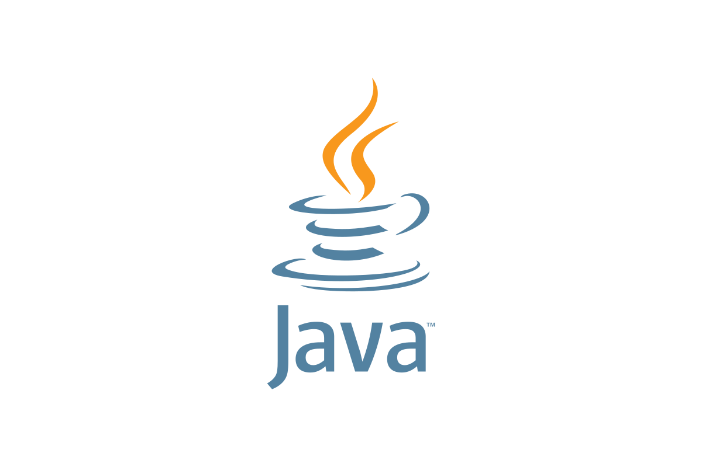

  

  

<h1 align="center">Hi 👋, I'm Andrey</h1>
<h3 align="center">Java Backend Developer</h3>

  
<b>About me — EN</b>

  
🔭 I’m a Java backend developer who builds clear, resilient REST services with Java 17/21 and Spring Boot. I focus on simple API contracts, predictable behavior, and strong validation.  
💼 Daily stack: Java 17/21, Spring Boot, JPA/Hibernate, MapStruct, PostgreSQL, Docker, Gradle, Git.  
🌱 Learning: Kafka, Redis, Keycloak, CI/CD.   
📫 Reach me: katazheh@gmail.com

  
<b>Обо мне — RU</b>

  
🔭 Разрабатываю понятные и надёжные REST-сервисы на Java 17/21 и Spring Boot; ценю простые контракты API, предсказуемость и строгую валидацию.  
💼 Ежедневный стек: Java 17/21, Spring Boot, JPA/Hibernate, MapStruct, PostgreSQL, Docker, Gradle, Git.  
🌱 Изучаю: Kafka, Redis, Keycloak, CI/CD.  
📫 Связь: katazheh@gmail.com

---

### 🧰 Tech stack

  
  
  
  
  
  
  
  
  
  
  
  

---

### 🚀 Featured projects

  
💰 MoneyHarbor — Personal Finance (WIP)

  Java 21 • Spring Boot 3.5 • PostgreSQL  • Gradle • Liquebase • Docker • Keycloak (OIDC) 
  Repo: <a href="https://github.com/AndreyTerex/MoneyHarbor">AndreyTerex/MoneyHarbor</a>

  
🎓 TesterQuiz — Servlet + Hibernate (no Spring)

  Full-featured quiz app with auth, admin and Docker setup. 
  Tech: Java 21, Servlets/JSP, Hibernate, PostgreSQL, Docker. 
  Repo: <a href="https://github.com/AndreyTerex/TesterQuiz">AndreyTerex/TesterQuiz</a>

  
📚 QuoteLib — Spring MVC + JDBC

  Quotes library with pagination, validation and global exception handling. 
  Tech: Java 17, Spring MVC, JdbcTemplate, PostgreSQL, Docker. 
  Repo: <a href="https://github.com/AndreyTerex/QuoteLib">AndreyTerex/QuoteLib</a>

